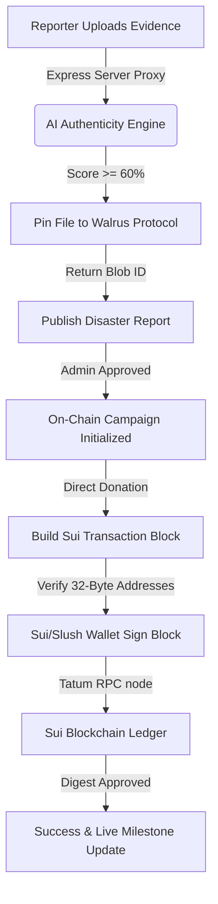

# 🌊 ReliefChain

### Verifiable Disaster Relief & Decentralized Aid Streaming Protocol

**ReliefChain** is a premium, web3-native humanitarian coordination and aid-streaming dApp built on the **Sui Blockchain** (Testnet) and integrated with the **Walrus Protocol** for decentralized storage. It combines strict cryptographic verification, multi-factor AI evidence analysis, and instant micro-donation streaming to deliver trust, auditability, and speed to global disaster relief efforts.

---

## 🚀 Core Features

### 1. Cryptographic Aid Streaming (Sui Move)
* **On-Chain Milestones:** Aid campaigns are created on-chain from approved disaster reports.
* **Direct Token Streams:** Supporters can stream `SUI` or `USDC` (with simulation wrappers for liquidity routing) directly to campaign milestones with **0% middleman fees**.
* **Modern Wallet Standard:** Complete compatibility with standard Sui providers (such as **Sui Wallet** and **Slush Wallet**), featuring safe, multi-tier fallback signing.
* **Strict Parameters Gatekeeping:** Includes full validation of 32-byte Sui addresses (66-character formatted) and gas budgets before handoff to prevent silent serialization failures.

### 2. Decentralized Proof Storage (Walrus Protocol)
* **Verifiable Audit Trails:** Supporting documents—including official NGO authorization papers, detailed budget spreadsheets, and verified on-the-ground photos/videos—are permanently stored on **Walrus Testnet**.
* **High-Speed CDN Aggregation:** Real-time data streaming of assets directly via decentralized Walrus gateway aggregates.
* **Local Fallback Layer:** Includes local uploads storage proxy layer to guarantee offline functionality if public testnet gateways face latency.

### 3. AI-Assisted Authenticity Verification
* **Multi-Factor AI Verification Engine:** Analyzes uploaded disaster evidence before publishing.
* **Authenticity Scoring:** Calculates dynamic ratings based on metadata, binary content entropy, file sizes, MIME-type consistency, and positive keyword matching.
* **Fraud Prevention:** Automatically blocks simulated placeholders or suspicious uploads from polluting the governance admin panels.

### 4. Interactive Glassmorphism Dashboard
* **Three.js Earth Graphics:** Stunning premium visual landing page with glassmorphism UI elements and micro-animations.
* **Admin Verification Terminal:** Fully interactive screen to inspect pending reports, review Walrus-hosted budget files, and approve/reject crisis campaigns.
* **Evidence Viewport Portal (`evidence.html`):** An embedded rich-media preview terminal supporting image, video, and PDF documents.

---

## 🛠️ Architecture & Transaction Flow



---

## 💻 Tech Stack

* **Frontend:** HTML5, Vanilla CSS3 (Custom design system), Javascript (ES6 modules, Three.js)
* **Vite Dev Server:** Hot Module Replacement (HMR) for local development
* **Backend:** Node.js, Express, Multer, Axios
* **Sui Integration:** `@mysten/sui` v2.x (CDNs & tsx configurations), `@mysten/wallet-standard`
* **Storage:** Walrus Testnet Publisher/Aggregator Protocol
* **Smart Contracts:** Sui Move Language (`/move`)

---

## ⚙️ Setting Up Locally

### Prerequisites
* **Node.js** (v18 or higher recommended)
* A browser with **Sui Wallet** or **Slush Wallet** installed.

### Step 1: Install Dependencies
Clone the repository and install packages for both frontend and backend:
```bash
npm install
```

### Step 2: Configure Environment Variables
Create a `.env` file in the root directory:
```env
PORT=3000
WALRUS_PUBLISHER=https://publisher.walrus-testnet.walrus.space
WALRUS_AGGREGATOR=https://aggregator.walrus-testnet.walrus.space
```

### Step 3: Run the Services
We recommend running both servers concurrently in separate terminals:

#### Terminal A: Start the Express Walrus Server
```bash
npm run server
```
*Launches backend proxy forwarding and the database on **http://localhost:3000***.

#### Terminal B: Start the Vite Dev Server
```bash
npm run dev
```
*Launches the premium reactive UI dashboard on **http://localhost:5173***.

---

## 🧪 On-Chain Verification & Testing

To perform a live, on-chain SUI stream verification:
1. Open the dApp at `http://localhost:5173/`.
2. Connect your **Sui/Slush Wallet** (ensure it is configured to **Sui Testnet**).
3. Request testnet tokens from the official faucet if your balance is low (`https://faucet.testnet.sui.io`).
4. Click **Donate SUI** on any active campaign card (e.g. *Assam Flood Emergency Relief*).
5. Input an amount (e.g., `0.1` SUI) and confirm.
6. The dApp will validate all properties, set the explicit gas budget, and call the wallet popup instantly.
7. Approve the signature, and watch the campaign progress bar dynamically recalculate in real-time as the transaction is indexed on-chain!

---

## 🛡️ License

This project is licensed under the MIT License.
